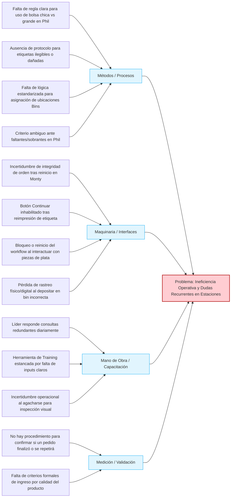

# Análisis de Diagrama de Ishikawa y Procesos - Estaciones de Trabajo

Este documento contiene el análisis del diagrama de Ishikawa para abordar la ineficiencia operativa y dudas recurrentes en las estaciones de empaque y robots, estructurado como una base de conocimientos (FAQ interactivo) y SOPs (Procedimientos Estándar de Operación) optimizados para la plataforma de Training.

---

## 1. Diagrama de Ishikawa (Causa-Efecto)

---

## 2. Mapa de Ruta para la Herramienta de Training

Cada una de las sub-espinas del diagrama de Ishikawa representa un módulo de aprendizaje obligatorio dentro del sistema de capacitación digital:

1. **Módulo de Criterios de Selección y Ubicación (Estación Phil):** Reglas precisas del tamaño de bolsas y mapeo físico/digital de bins.
2. **Módulo de Manejo de Excepciones de Hardware (Monty/Bagger):** Protocolos ante fallas del botón "Continuar", reinicios repentinos de flujo e interacción con piezas reflectivas.
3. **Módulo de Seguridad Industrial y Ergonomía:** Restricciones de inspección visual y uso de herramientas auxiliares según tipo de robot y cliente.
4. **Módulo de Trazabilidad e Inventario:** Procedimiento de contención y re-asociación ante desalineación de bins o discrepancias físicas en estación.

---

## 3. SOPs y Base de Conocimientos (Formato 3 Pasos)

A continuación se detallan los procedimientos operativos estandarizados para cada uno de los puntos críticos identificados:

### A. Estación Phil: Regla de Empaque y Ubicación de Bins

#### FAQ 1: ¿Cuándo utilizar bolsa chica vs. bolsa grande en la Estación Phil?
*   **Regla Matemática/Visual:**
    *   **Bolsa Chica (Small Bag):** Para productos con dimensiones físicas máximas de $15\text{ cm} \times 15\text{ cm} \times 5\text{ cm}$ y un peso inferior a $500\text{ gramos}$.
    *   **Bolsa Grande (Large Bag):** Para cualquier producto que exceda cualquiera de los límites anteriores o contenga esquinas punzantes que requieran doble empaque.
*   **Regla de Ubicación de Bins:**
    *   **Etiqueta CON texto descriptivo:** Depositar el artículo obligatoriamente en la **primera bin** (Bin A1, más cercana al operador).
    *   **Etiqueta SIN texto descriptivo (solo código de barras/QR):** Depositar el artículo obligatoriamente en la **bin alejada** (Bin B4, al final de la línea).

*   **Paso 1: Acción Inmediata (Contención):**
    Evaluar visualmente el tamaño del ítem contra la plantilla de dimensiones pegada en la mesa de trabajo. Validar el contenido de la etiqueta para identificar la presencia de texto.
*   **Paso 2: Validación en Sistema:**
    Escanear el código del producto. En pantalla se mostrará la sugerencia de bin (Bin A1 o Bin B4) según la regla de texto de etiqueta. Confirmar la selección del tamaño de bolsa en la interfaz táctil.
*   **Paso 3: Cierre de Orden Seguro:**
    Introducir el producto en la bolsa seleccionada, sellar, escanear el código de barras final del empaque y depositarlo en el bin correspondiente. Verificar que el indicador LED del bin se ilumine en verde antes de procesar el siguiente artículo.

---

### B. Estación Phil: Discrepancias de Inventario

#### FAQ 2: ¿Qué hacer ante un faltante o sobrante de producto en la Estación Phil?
*   **Paso 1: Acción Inmediata (Contención):**
    Detener temporalmente el flujo de escaneo. Retirar el artículo excedente (en caso de sobrante) o pausar la caja actual (en caso de faltante).
*   **Paso 2: Validación en Sistema:**
    Presionar el botón **"Reportar Discrepancia"** en la interfaz de la Estación Phil. Escanear el código del último artículo procesado con éxito para verificar la coincidencia del inventario digital.
*   **Paso 3: Cierre de Orden Seguro:**
    *   *Si es faltante:* Registrar en el sistema como "Faltante de Ítem", desviar la orden al área de Re-work y colocar la caja física en el carril rojo de excepciones.
    *   *Si es sobrante:* Escanear el sobrante en el modo "Validar Ítem Huérfano" y colocarlo en el contenedor gris de devoluciones internas para auditoría de inventario.

---

### C. Bagger/Monty: Incertidumbre de Integridad de Orden tras Reinicio

#### FAQ 3: La máquina Monty se reinició inesperadamente. ¿Cómo sé si la etiqueta de la orden en curso se repetirá o si la orden finalizó correctamente?
*   **Paso 1: Acción Inmediata (Contención):**
    Presionar el botón físico de pausa en la Bagger Monty. Retirar la última bolsa que se encontraba en el canal de sellado y colocarla en la bandeja de inspección de seguridad (bandeja amarilla).
*   **Paso 2: Validación en Sistema:**
    Iniciar sesión en la interfaz de la Bagger y acceder al panel **"Historial de Órdenes Recientes"**. Verificar el ID de la última orden:
    *   Si el estado es `COMPLETED` (Completada): La orden finalizó correctamente en el backend.
    *   Si el estado es `INTERRUPTED` (Interrumpida) o `PENDING` (Pendiente): El sistema requerirá re-procesar.
*   **Paso 3: Cierre de Orden Seguro:**
    *   *Si el estado es `COMPLETED`:* Colocar la bolsa retirada en la banda de salida.
    *   *Si el estado es `INTERRUPTED`:* Romper la bolsa anterior para recuperar el artículo, escanear de nuevo el artículo en la estación para regenerar el workflow y permitir que la Bagger imprima una nueva etiqueta limpia.

---

### D. Bagger/Monty: Botón "Continuar" Congelado tras Reimpresión

#### FAQ 4: Tras reimprimir una etiqueta de empaque, el botón "Continuar" en la pantalla táctil queda inhabilitado (gris). ¿Cómo reactivar la interfaz?
*   **Paso 1: Acción Inmediata (Contención):**
    No presionar repetidamente la pantalla táctil. Desconectar el escáner de mano de su base de carga o puerto USB durante 3 segundos y volverlo a conectar para forzar la inicialización del hardware de lectura.
*   **Paso 2: Validación en Sistema:**
    Verificar que el indicador de conexión del escáner en la esquina superior derecha de la UI se muestre en color verde (Conectado). Si sigue en rojo, escanear el código de barras de configuración **"RESET_UI_FOCUS"** adherido al marco físico del monitor.
*   **Paso 3: Cierre de Orden Seguro:**
    Una vez restablecido el foco de la pantalla y activo el botón "Continuar" (en color azul), realizar una lectura de prueba del código de la orden en curso. La interfaz avanzará al siguiente paso de manera automática.

---

### E. Bagger/Monty: Interacción con Piezas de Plata

#### FAQ 5: Al procesar piezas metálicas reflectivas (plata/aluminio), el lector o el robot Monty se bloquea o genera errores de lectura repetidos.
*   **Paso 1: Acción Inmediata (Contención):**
    Retirar la pieza metálica reflectiva del área de lectura automática del robot. Colocar la pieza dentro de la bandeja de acrílico gris anti-reflejo provista en la estación.
*   **Paso 2: Validación en Sistema:**
    En la interfaz del sistema de visión artificial, presionar el botón **"Filtro Polarizado Digital"** o cambiar el perfil de visión a **"Modo Metal Reflectivo"** en el panel lateral.
*   **Paso 3: Cierre de Orden Seguro:**
    Utilizar el escáner de mano (en lugar del lector láser fijo superior) para realizar la lectura de la etiqueta. Confirmar visualmente que el software procese el registro (el SKU cambiará a color verde) y reanudar la operación automática del brazo robótico.

---

### F. Seguridad: Inspección Visual y Ergonomía

#### FAQ 6: ¿Cuáles son las reglas de seguridad al realizar inspecciones visuales de bolsas caídas o atascadas en los robots?
*   **Regla Operativa Sin Ambigüedad:**
    *   **PROHIBIDO AGACHARSE** para inspección visual o física en estaciones equipadas con robots de brazo pesado **Fanuc F-200** y bajo cualquier circunstancia en las líneas dedicadas al cliente **AeroLogistics**.
    *   **PERMITIDO CON RESTRICCIÓN** únicamente en las celdas de robots colaborativos **UR10 (Universal Robots)**, siempre y cuando se presione primero el botón de parada de emergencia (E-Stop) de la celda y el operador cuente con arnés de soporte lumbar.

*   **Paso 1: Acción Inmediata (Contención):**
    Si un paquete cae en la parte inferior de la celda, presionar inmediatamente el interruptor **E-Stop** físico de la estación de trabajo.
*   **Paso 2: Validación en Sistema:**
    Validar en el monitor de control que el indicador de seguridad muestre el estado en color amarillo: `SAFE_STATE - MOTORS_DISABLED` (Estado Seguro - Motores Desactivados).
*   **Paso 3: Cierre de Orden Seguro:**
    Utilizar la pinza de extensión telescópica de 1.2 metros ubicada a un costado de la celda para recuperar el paquete del suelo. **Nunca introducir el torso ni la cabeza dentro de la celda robótica.** Colocar el paquete en la bandeja de excepciones, restablecer el E-Stop girándolo en sentido horario y presionar "Aceptar Alarma" en la interfaz digital para reanudar.

---

### G. Trazabilidad: Error de Depósito en Bins

#### FAQ 7: He colocado un producto físicamente en una bin incorrecta. ¿Cómo restauro la trazabilidad digital del paquete?
*   **Paso 1: Acción Inmediata (Contención):**
    Detener la manipulación de cualquier otra orden. Extraer inmediatamente el paquete depositado de forma incorrecta para evitar mezclarlo con otros ítems.
*   **Paso 2: Validación en Sistema:**
    Escanear el código de barras de la ubicación de la bin donde ocurrió el error. La pantalla indicará el ID de orden que el sistema espera en esa bin. Escanear seguidamente el paquete extraído para que el sistema calcule el desvío.
*   **Paso 3: Cierre de Orden Seguro:**
    En el menú administrativo, seleccionar la función **"Re-asociar Ubicación"**. Escanear la etiqueta de la bin correcta a la cual pertenece el producto, depositar físicamente el paquete allí y pulsar "Confirmar Ubicación" en la UI. Asegurarse de que el LED indicador del nuevo bin destelle en verde.
